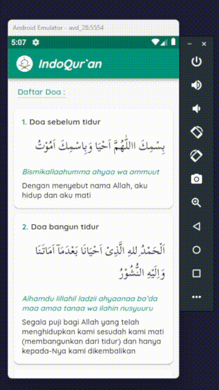

# UAS PEMPROGRAMAN MOBILE 2
**Nama : Muhammad Akbar**<br>
**Nim : 312110483**<br>
**Kelas : TI.21.A3**

<br>

## Tech Stack
- Flutter
- Dart

<br>

## Features
- Menampilkan daftar doa-doa harian
- Doa text arab, latin dan arti dalam bahasa indonesia

<br>

## API Reference
```py
  GET  https://doa-doa-api-ahmadramadhan.fly.dev/api
```

<br>

## Demo
<div align='center'>
  
</div>

